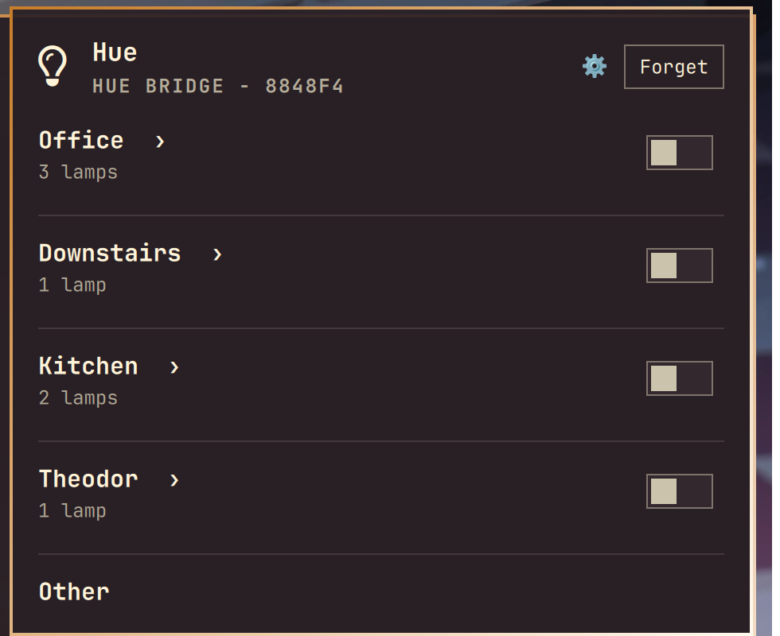
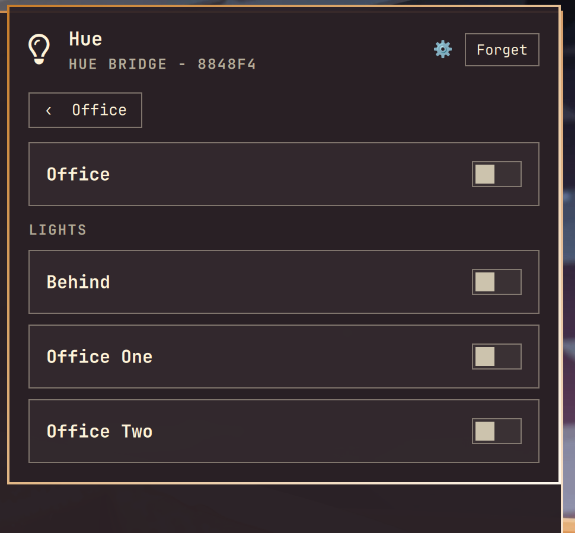
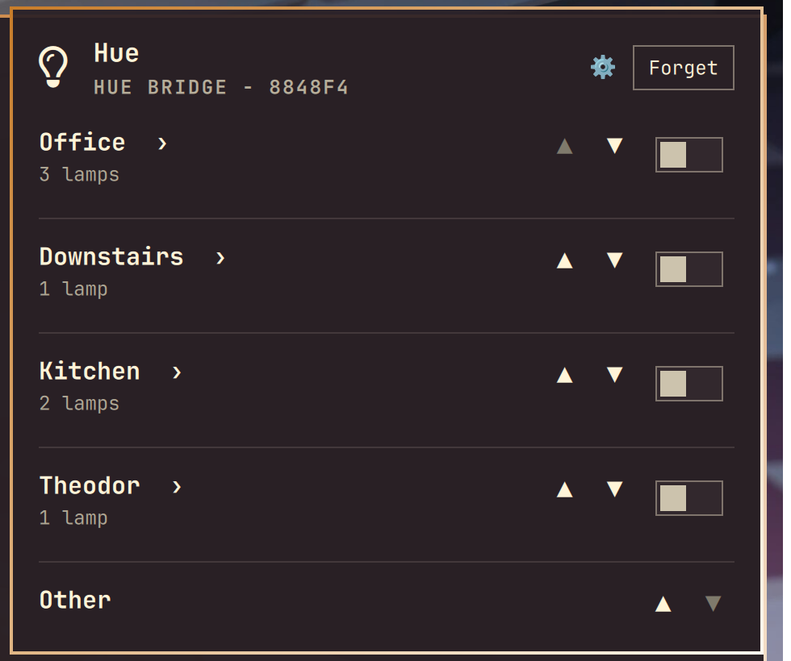
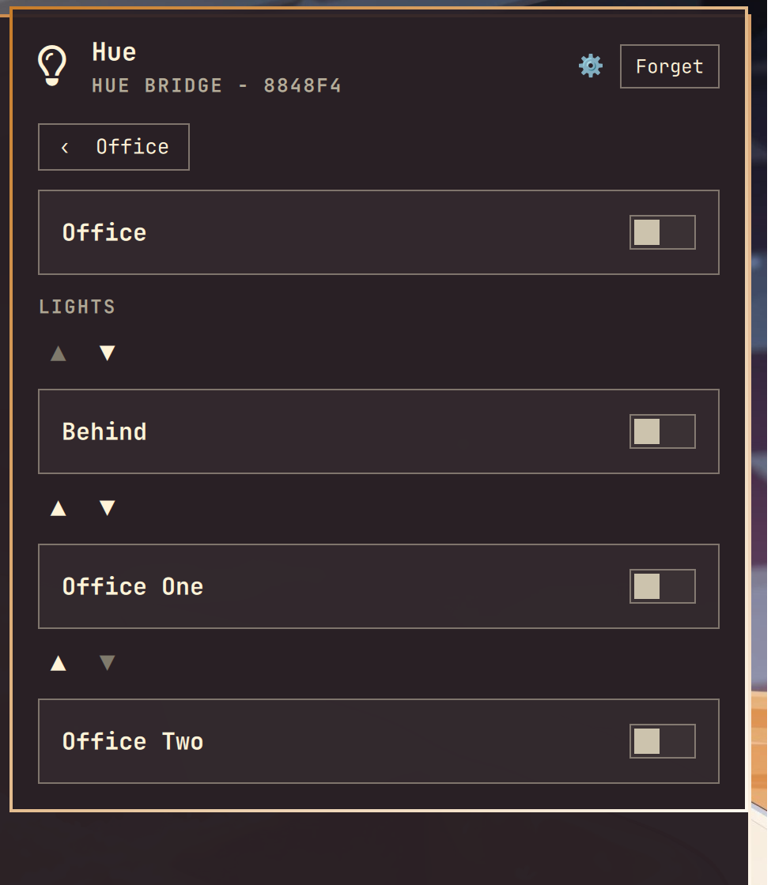

# Hue

Control a local Hue Bridge from the Omarchy bar. Rooms open into their own panel for scenes, lights, switches, and sensors.



The bar widget and the Go command live in this repository. The widget starts `hue serve`, which keeps one connection to the bridge open. The application key is stored in `~/.config/hue/bridge.json` and is not part of this repo. The bridge uses a self-signed certificate, so the command talks to it over TLS without verifying that certificate. That trust is limited to the bridge address on your LAN.

## Install

```sh
omarchy plugin add https://github.com/SneWs/hue.git --enable
```

Each push to `main` builds `hue` for Linux x64 and ARM64 and publishes those files on the [latest release](https://github.com/SneWs/hue/releases/tag/latest). A `v*` tag publishes a versioned release instead. Put the matching file on your `PATH` as `hue`:

```sh
curl -fsSL -o ~/.local/bin/hue https://github.com/SneWs/hue/releases/download/latest/hue-linux-amd64
chmod +x ~/.local/bin/hue
```

Use `hue-linux-arm64` on ARM64. You can also build it yourself from the installed checkout. Go 1.27 or newer is required. This repo pins 1.27.1 in `mise.toml` for [mise](https://mise.jdx.dev/) users.

```sh
cd ~/.config/omarchy/plugins/grenis.hue
go build -o ~/.local/bin/hue ./cmd/hue
```

Opening the panel registers with `hue serve`. Until the binary is on `~/.local/bin/hue`, the lightbulb has nothing to call.

## Usage

Click the lightbulb to open the panel. If no bridge is paired, pick the one on your network and press its link button.

Rooms with lamps show a count and a ›. Click the name to open that room's scenes, lights, switches, and sensors. The switch on the room row turns the whole room on or off. Escape returns from a room to the list, then closes the panel.



Click the gear to reorder. Up and down move a room in the list, or a light inside the open room. The order is saved in `~/.config/hue/order.json` and kept across restarts. New rooms and lights show up at the end until you move them.





## Configure

```sh
omarchy bar move grenis.hue --section right
```

## Remove

```sh
omarchy plugin remove grenis.hue
rm -f ~/.local/bin/hue
```

`omarchy plugin remove` deletes an installed git checkout. The saved bridge key stays in `~/.config/hue/bridge.json`. Delete that file too if you want to forget the bridge.

## This checkout

`~/.config/omarchy/plugins/grenis.hue` is a link to this repository, so the shell loads these files directly. `omarchy plugin remove grenis.hue` removes that link and leaves this folder in place. The shell watcher does not follow the link, so after a QML change run:

```sh
omarchy-shell shell rescanPlugins
```
